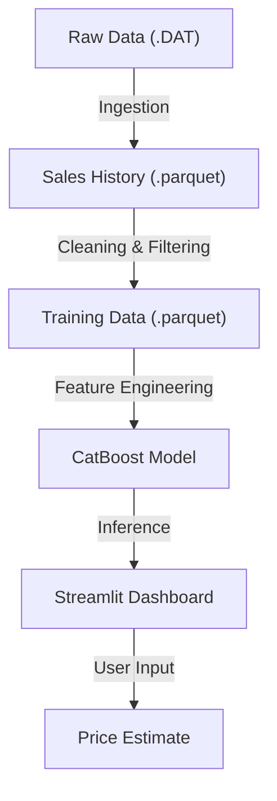

# 🏡 House Price Estimator (Sydney, AU)

> [!WARNING]
> **Work in Progress**: The prediction model is currently in development. While it provides estimates based on historical data, it is not yet fully optimized for production use.

This project uses machine learning to estimate property prices in the Sydney real estate market. It analyzes 8 years of historical sales data to identify trends and predict values based on location, property type, and size.

## 🏗️ Architecture



## 📊 Data Pipeline

1.  **Source**: [NSW Valuer General](https://www.valuergeneral.nsw.gov.au/__psi/yearly/20XX.zip) (sales data 2016-2024).
2.  **Ingestion**: 
    - Parsed ~60,000 raw `.DAT` files (semicolon-separated).
    - Consolidated **1.9 Million** records into a single optimized Parquet file.
3.  **Preprocessing**:
    - **Timeframe**: Filtered to **2018 - 2024** (relevant market history).
    - **Property Types**: Restricted to `RESIDENCE` and `STRATA UNIT`.
    - **Outlier Removal**: 
        - Excluded prices < $200k (e.g., parking spots).
        - Excluded prices > $10M (commercial/luxury outliers).
    - **Result**: ~1.08 Million high-quality training records.

## 🤖 Model Details

- **Algorithm**: `CatBoost Regressor`
- **Features**: 
    - Categorical: `Suburb`, `PropertyType`, `Postcode`, `Zoning`
    - Numerical: `Area`
    - Temporal: `Year`, `Quarter`
- **Current Performance**:
    - **R² Score**: 0.70 (Explains ~70% of price variance)
    - **MAE**: ~$255k AUD

## 🚀 How to Run

1.  **Clone the repository**
    ```bash
    git clone https://github.com/your-username/house-price-estimator.git
    cd house-price-estimator
    ```

2.  **Set up environment**
    ```bash
    uv venv  # or python -m venv .venv
    source .venv/bin/activate
    pip install -r requirements.txt
    ```

3.  **Run the Dashboard**
    ```bash
    streamlit run dashboard.py
    ```

## 🔮 Future Work
- [ ] Integrate SHAP values for model explainability.
- [ ] Add geospatial features (distance to CBD, schools).
- [ ] containerize with Docker for deployment.
